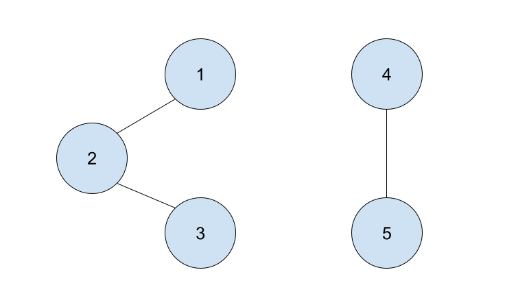
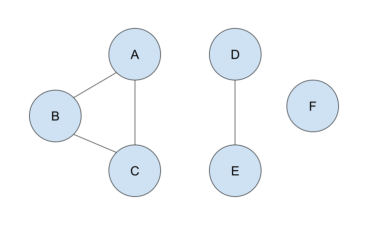
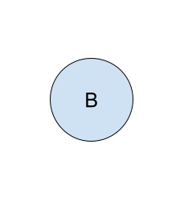

# Implement Components of a Graph

## Problem

Given an undirected graph represented by an adjacency dictionary, `g`, return a list of lists containing all of the subgraphs in the graph. Each element in the outer list will represent a subgraph in the graph. Each element in the inner lists will contain all of the nodes in a subgraph. Please note the items in the inner lists must be sorted.

The goal is to return a list of lists containing all of the subgraphs in graph `g`. 

**Example 1:**



```
Input: 

g = {
    1: [2],
    2: [1, 3],
    3: [2],
    4: [5],
    5: [4]
}

Output: [[1, 2, 3], [4,5]]
Explanation: The nodes 1, 2, & 3 are all connected together, and thus comprise a list in the output. Similarly, the nodes 4 & 5 are connected to each other, and comprise another list in the output.
```

**Example 2:**



```
Input:

g = {
    "A": ["B", "C"],
    "B": ["A", "C"],
    "C": ["A", "B"],
    "D": ["E"],
    "E": ["D"],
    "F": []
}

Output: [["A", "B", "C"], ["D", "E"], ["F"]]
Explanation: The nodes A, B, and C are all connected, so will be an item in the list. Nodes D and E are connected, so will be another item in the resulting list. Finally, node F is not connected to any other node, so it is the only item in the final list.
```

**Example 3:**



```
Input: 

g = {
    "B": []
}

Output: [["B"]]
Explanation: Node B is the only node in the graph, so the function will return a list containing one list, which will contain one item, node B.
```

Adapted from:  [GeeksForGeeks](https://www.geeksforgeeks.org/connected-components-in-an-undirected-graph/)

### !challenge

* type: code-snippet
* language: python3.6
* id: a292383f-196c-4e98-91ff-6ce22059bcb1
* title: Graph Components Coding Challenge
* points: 3
* topics: python, graphs, traversals

##### !question

Write a solution to the Graph Components function below.

##### !end-question

##### !placeholder

```py
def components(g):
    pass

```

##### !end-placeholder

##### !tests

```py
import unittest
from main import components

class TestPython1(unittest.TestCase):
    def test_components_example_one(self):
        # Arrange
        g = {
            1: [2],
            2: [1, 3],
            3: [2],
            4: [5],
            5: [4]
        }

        # Act
        answer = components(g)
        answer.sort()

        # Assert
        self.assertEqual(answer, [[1,2,3],[4,5]].sort())

    def test_components_example_two(self):
        # Arrange
        g = {
            "A": ["B", "C"],
            "B": ["A", "C"],
            "C": ["A", "B"],
            "D": ["E"],
            "E": ["D"],
            "F": []
        }

        # Act
        answer = components(g)
        answer.sort()

        # Assert
        self.assertEqual(answer, [["A", "B", "C"], ["D", "E"], ["F"]].sort())

    def test_components_example_three(self):
        # Arrange
        g = {
            "B": []
        }

        # Act
        answer = components(g)
        answer.sort()

        # Assert
        self.assertEqual(answer, [["B"]])
        
    def test_components_empty_graph(self):
        # Arrange
        g = {}

        # Act
        answer = components(g)
        answer.sort()

        # Assert
        self.assertEqual(answer, [])
```

##### !end-tests

##### !explanation

Our DFS solution:

```python
def components(g):
    pass
```

Our BFS solution:

```python
def components(g):
    pass
```

##### !end-explanation

### !end-challenge

<!-- >>>>>>>>>>>>>>>>>>>>>> BEGIN CHALLENGE >>>>>>>>>>>>>>>>>>>>>> -->

### !challenge

* type: paragraph
* id: ed25526f-88eb-4b45-aa4e-b340dba3d367
* title: What is the time complexity of your solution?
* points: 1
* topics: Big-O, python

##### !question

What is the time complexity of your solution? Explain. Define your variable(s).

##### !end-question

##### !placeholder

Time Complexity?

##### !end-placeholder

##### !answer

/.+/

##### !end-answer

### !end-challenge

<!-- ======================= END CHALLENGE ======================= -->

<!-- >>>>>>>>>>>>>>>>>>>>>> BEGIN CHALLENGE >>>>>>>>>>>>>>>>>>>>>> -->

### !challenge

* type: paragraph
* id: fda55052-b2c2-401d-b870-39d7080042dc
* title: What is the space complexity of your solution?
* points: 1
* topics: Big-O, python

##### !question

What is the space complexity of your answer? Explain. Define your variable(s).

##### !end-question

##### !placeholder

Space Complexity?

##### !end-placeholder

##### !answer

/.+/

##### !end-answer

### !end-challenge

<!-- ======================= END CHALLENGE ======================= -->

## Reminders

- Finish this assignment individually.
- If you'd like a full list of our tips, hints, and notes, please bring up the document "[About Problem Solving Exercises](../about-pses/about-pses.md )" in unit.
