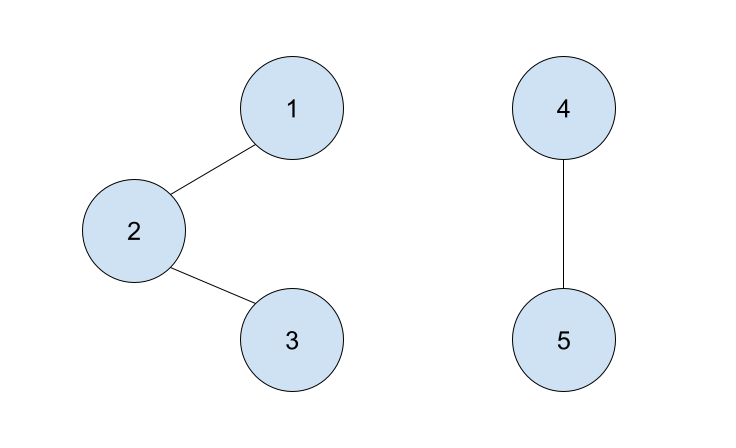

# Components of a Graph

## Problem

Given an undirected graph represented by an adjacency dictionary, `g`, return a list of lists containing all of the subgraphs in the graph. Each element in the outer list will represent a subgraph in the graph. Each element in the inner lists will contain all of the nodes in a subgraph. Please note the items in the inner lists must be sorted.

The goal is to return a list of lists containing all of the subgraphs in graph `g`. 

**Example 1:**



```
Input: 

g = {
    1: [2],
    2: [1, 3],
    3: [2],
    4: [5],
    5: [4]
}

Output: [[1, 2, 3], [4,5]]
Explanation: The nodes 1, 2, & 3 are all connected together, and thus comprise a list in the output. Similarly, the nodes 4 & 5 are connected to each other, and comprise another list in the output.
```

**Example 2:**


```
Input:

g = {
    "A": ["B", "C"],
    "B": ["A", "C"],
    "C": ["A", "B"],
    "D": ["E"],
    "E": ["D"],
    "F": []
}

Output: [["A", "B", "C"], ["D", "E"], ["F"]]
Explanation: The nodes A, B, and C are all connected, so will be an item in the list. Nodes D and E are connected, so will be another item in the resulting list. Finally, node F is not connected to any other node, so it is the only item in the final list.
```

**Example 3:**


```
Input: 

g = {
    "B": []
}

Output: [["B"]]
Explanation: Node B is the only node in the graph, so the function will return a list containing one list, which will contain one item, node B.
```

Adapted from:  [GeeksForGeeks](https://www.geeksforgeeks.org/connected-components-in-an-undirected-graph/)


## Prompts

<!-- Question 1 -->
<!-- prettier-ignore-start -->
### !challenge
* type: paragraph
* id: c1ef7da4-56b8-4fd0-959d-28daf5d61822
* title: Ask Clarifying Questions
* topics: pse
##### !question

List three or more questions whose answers would clarify the problem statement

##### !end-question
##### !hint

Consider the following for inspiration:

- [About PSEs](../about-pses/about-pses.md)
- [Our example PSE with example answers](../about-pses/example-pse.md)
- Any past PSEs you may have

##### !end-hint

##### !explanation

Here are some example clarifying questions:

- What type of data will be stored in the graph?
- Is the graph guaranteed to have a valid input?
- Is the graph guaranteed to have data? Can the graph be empty?

##### !end-explanation

##### !rubric

- The answer is wrong if there aren't at least 3 questions

##### !end-rubric

### !end-challenge
<!-- prettier-ignore-end -->


<!-- Question 2 -->
<!-- prettier-ignore-start -->

### !challenge
* type: code-snippet
* language: python3.6
* id: d95aaa33-7c8b-4f65-a2b9-6cfe2daf0edd
* title: Write Unit Tests
* topics: pse
##### !question

1. Use the comments provided to write at least two example input/outputs:
    * Consider at least one nominal and one edge case.
    * What is the expected output for the given input?
    * You can use the examples provided in the prompt, or other examples.
2. Write unit tests for `components` for the nominal and edge cases you identified in the first step.

*Note: Click the **Run Tests** button to save your tests for instructor feedback. No real tests are actually run against your unit tests.*

##### !end-question

##### !placeholder

```py
# example input 1:
# expected output 1:

# example input 2:
# expected output 2:

def test_nominal_case():
    # ^rename with meaningful test name
    # and complete test implementation below
    pass
    # arrange

    # act

    # assert

def test_edge_case():
    # ^rename with meaningful test name
    # and complete test implementation below
    pass
    
    # arrange
    
    # act
    
    # assert
```

##### !end-placeholder

##### !tests

```py
import unittest

class TestPython1(unittest.TestCase):
  def test_always_pass(self):
    self.assertEqual(1,1)
```

##### !end-tests

##### !explanation 

Example tests:

```python
def test_components_nominal(self):
    # Arrange
    g = {
        "A": ["B", "C"],
        "B": ["A", "C"],
        "C": ["A", "B"],
        "D": ["E"],
        "E": ["D"],
        "F": []
    }

    # Act
    answer = components(g)
    answer.sort()

    # Assert
    self.assertEqual(answer, sorted([["A", "B", "C"], ["D", "E"], ["F"]]))

def test_components_empty_graph(self):
    # Arrange
    g = {}

    # Act
    answer = components(g)

    # Assert
    self.assertEqual(answer, [])
```

##### !end-explanation
### !end-challenge
<!-- prettier-ignore-end -->

<!-- Question 3 -->
<!-- prettier-ignore-start -->
### !challenge
* type: paragraph
* id: 47c0a592-a2ac-4110-b1f2-54e5de791780
* title: Create Logical Steps
* topics: pse
##### !question

Without writing code, describe how you would implement `components` in enough detail that someone else could write the code. 

* It may be helpful to break up the problem/algorithm into smaller subproblems/algorithms. For example, 1. Handle invalid input, 2. Given valid input, perform the computation/solve the problem/etc.
* Your logical steps could take the form of a numbered list, pseudo code, or anywhere in between. What's important at this stage is to think through and outline the implementation before writing code.

##### !end-question

##### !placeholder

Write the logical steps here.

##### !end-placeholder

### !explanation

Example Steps for a solution utilizing depth first search

1. Create a helper function to run depth first search on a subgraph
1. In the main function, create variables to hold the resulting list of subgraphs and a variable to hold the list of all visited nodes
1. For each node in the graph:
    1. If the node has not been visited:
        1. Create a temporary list to hold all of the nodes in the subgraph
        1. Perform a depth first traversal on the subgraph using the helper function
        1. Add the temporary list containing the subgraph to the list of subgraphs
1. Return the list of subgraphs

### !end-explanation

### !end-challenge
<!-- prettier-ignore-end -->
